Channel information
===================
    

Channel information at: T = 23.0 degC, E_rev = 0 mV, [Ca2+] = 0.0005 mM

<table>
    <tr>
<td width="120px">
            <b>Golgi_NaR</b> 
            <a href="../Golgi_NaR.channel.nml">Golgi_NaR.channel.nml</a> 
            <b>Ion: na</b> 
            <i>g = gmax * s * f </i> 
            Resurgent Na+ channel
</td>
<td>
<a href="Golgi_NaR.inf.png">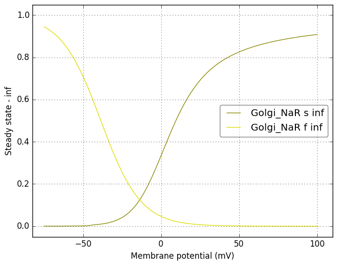</a>
</td>
<td>
<a href="Golgi_NaR.tau.png">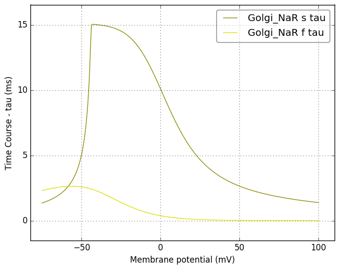</a>
</td>
</tr>
    <tr>
<td width="120px">
            <b>Golgi_NaP</b> 
            <a href="../Golgi_NaP.channel.nml">Golgi_NaP.channel.nml</a> 
            <b>Ion: na</b> 
            <i>g = gmax * m </i> 
            Persistent Na+ channel
</td>
<td>
<a href="Golgi_NaP.inf.png">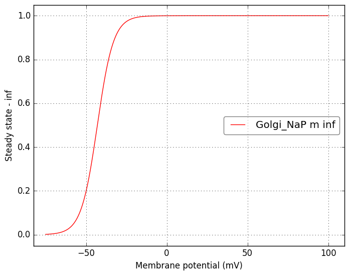</a>
</td>
<td>
<a href="Golgi_NaP.tau.png">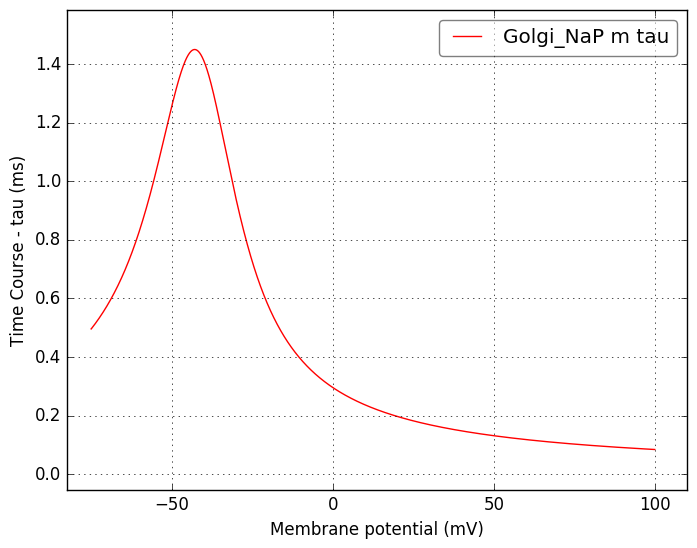</a>
</td>
</tr>
    <tr>
<td width="120px">
            <b>Golgi_NaT</b> 
            <a href="../Golgi_NaT.channel.nml">Golgi_NaT.channel.nml</a> 
            <b>Ion: na</b> 
            <i>g = gmax * m3 * h </i> 
            Transient Na+ channel
</td>
<td>
<a href="Golgi_NaT.inf.png">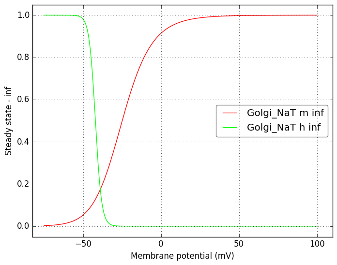</a>
</td>
<td>
<a href="Golgi_NaT.tau.png">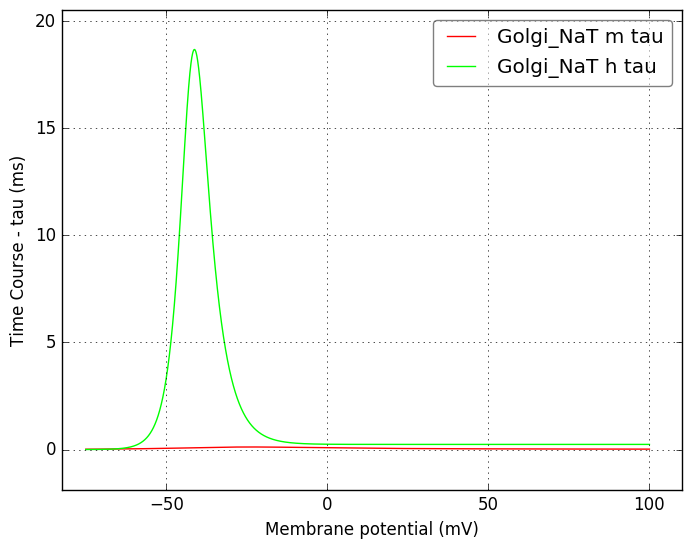</a>
</td>
</tr>
    <tr>
<td width="120px">
            <b>Golgi_KA</b> 
            <a href="../Golgi_KA.channel.nml">Golgi_KA.channel.nml</a> 
            <b>Ion: k</b> 
            <i>g = gmax * a3 * b </i> 
            A type K+ channel
</td>
<td>
<a href="Golgi_KA.inf.png">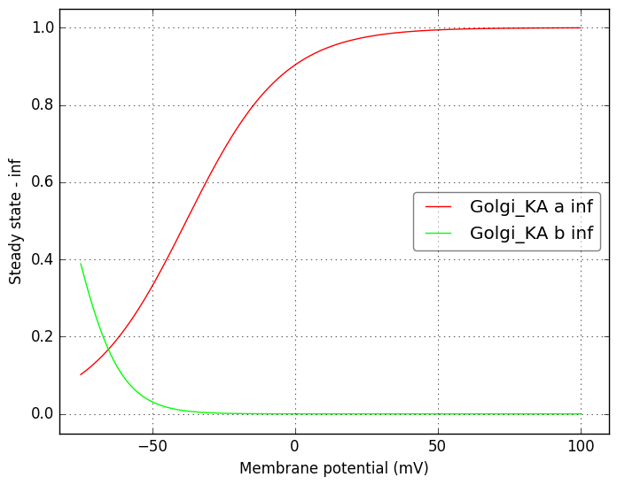</a>
</td>
<td>
<a href="Golgi_KA.tau.png">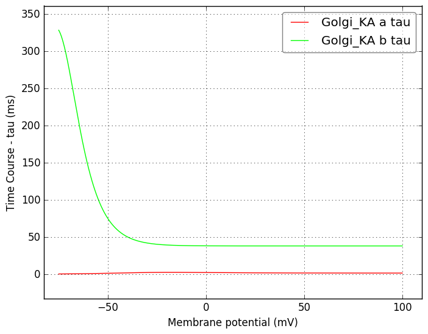</a>
</td>
</tr>
    <tr>
<td width="120px">
            <b>Golgi_KC</b> 
            <a href="../Golgi_KC.channel.nml">Golgi_KC.channel.nml</a> 
            <b>Ion: k</b> 
            <i>g = gmax * c </i> 
            BK type voltage and [Ca2+] dependent K+ channel
</td>
<td>
<a href="Golgi_KC.inf.png">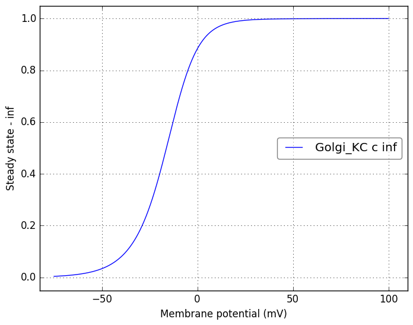</a>
</td>
<td>

</td>
</tr>
    <tr>
<td width="120px">
            <b>Golgi_KV</b> 
            <a href="../Golgi_KV.channel.nml">Golgi_KV.channel.nml</a> 
            <b>Ion: k</b> 
            <i>g = gmax * n4 </i> 
            Delayed rectifier K+ channel, based on mod file supplied with Solinas et al 2007 (ModelDB 112685)
</td>
<td>
<a href="Golgi_KV.inf.png">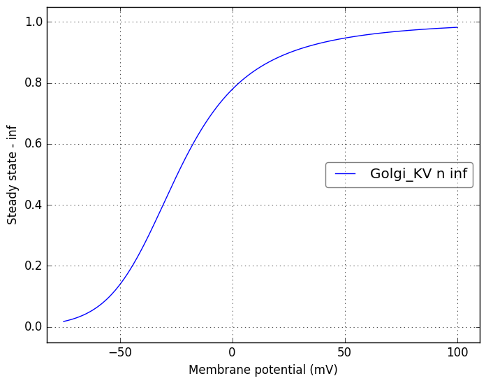</a>
</td>
<td>

</td>
</tr>
    <tr>
<td width="120px">
            <b>Golgi_Kslow</b> 
            <a href="../Golgi_Kslow.channel.nml">Golgi_Kslow.channel.nml</a> 
            <b>Ion: k</b> 
            <i>g = gmax * n </i> 
            A slow M-like K+ channel, based on mod file supplied with Solinas et al 2007 (ModelDB 112685)
</td>
<td>

</td>
<td>
<a href="Golgi_Kslow.tau.png">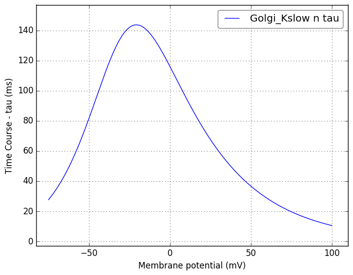</a>
</td>
</tr>
    <tr>
<td width="120px">
            <b>Golgi_Ca_HVA</b> 
            <a href="../Golgi_Ca_HVA.channel.nml">Golgi_Ca_HVA.channel.nml</a> 
            <b>Ion: ca</b> 
            <i>g = gmax * s2 * u </i> 
            High voltage Activated Ca2+ channel, based on mod file supplied with Solinas et al 2007 (ModelDB 112685)
</td>
<td>
<a href="Golgi_Ca_HVA.inf.png">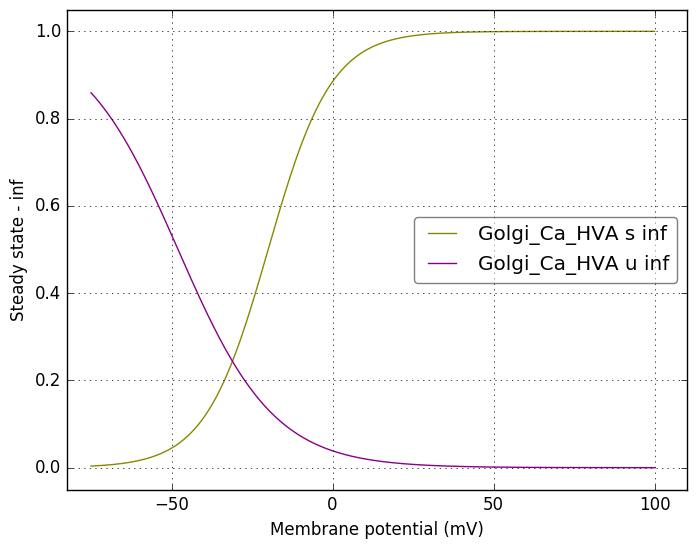</a>
</td>
<td>
<a href="Golgi_Ca_HVA.tau.png">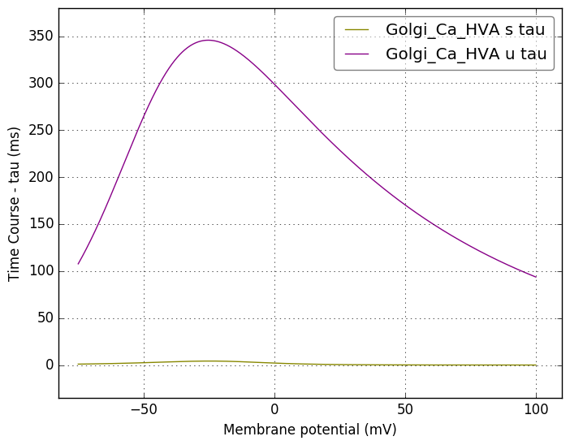</a>
</td>
</tr>
    <tr>
<td width="120px">
            <b>Golgi_hcn1f</b> 
            <a href="../Golgi_hcn1f.channel.nml">Golgi_hcn1f.channel.nml</a> 
            <b>Ion: h</b> 
            <i>g = gmax * f </i> 
            hcn1 channel - fast component
</td>
<td>

</td>
<td>

</td>
</tr>
    <tr>
<td width="120px">
            <b>Golgi_hcn2f</b> 
            <a href="../Golgi_hcn2f.channel.nml">Golgi_hcn2f.channel.nml</a> 
            <b>Ion: h</b> 
            <i>g = gmax * f </i> 
            hcn2 channel - fast component
</td>
<td>
<a href="Golgi_hcn2f.inf.png">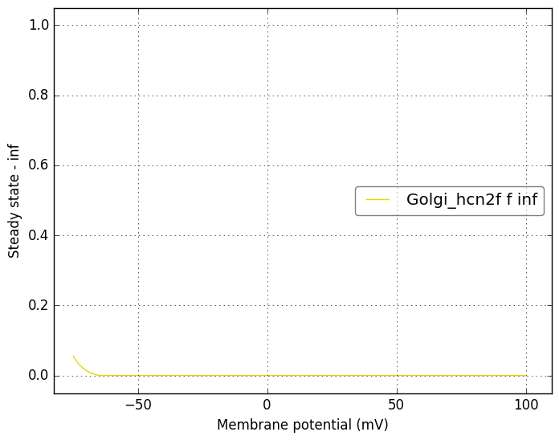</a>
</td>
<td>

</td>
</tr>
    <tr>
<td width="120px">
            <b>Golgi_Ca_LVA</b> 
            <a href="../Golgi_Ca_LVA.channel.nml">Golgi_Ca_LVA.channel.nml</a> 
            <b>Ion: ca2</b> 
            <i>g = gmax * m2 * h </i> 
            Low voltage Activated Ca2+ channel. Uses name ca2 for calcium ion
</td>
<td>

</td>
<td>

</td>
</tr>
    <tr>
<td width="120px">
            <b>Golgi_hcn1s</b> 
            <a href="../Golgi_hcn1s.channel.nml">Golgi_hcn1s.channel.nml</a> 
            <b>Ion: h</b> 
            <i>g = gmax * s </i> 
            hcn1 channel - slow component
</td>
<td>

</td>
<td>

</td>
</tr>
    <tr>
<td width="120px">
            <b>Golgi_hcn2s</b> 
            <a href="../Golgi_hcn2s.channel.nml">Golgi_hcn2s.channel.nml</a> 
            <b>Ion: h</b> 
            <i>g = gmax * s </i> 
            hcn2 channel - slow component
</td>
<td>
<a href="Golgi_hcn2s.inf.png">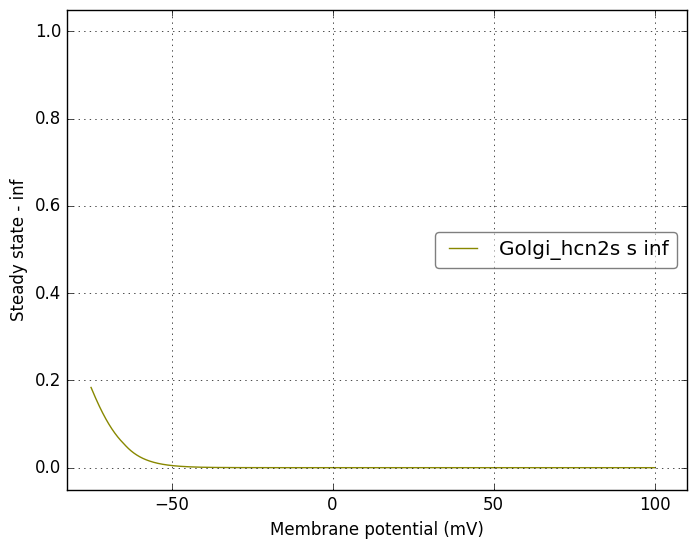</a>
</td>
<td>

</td>
</tr>
</table>

